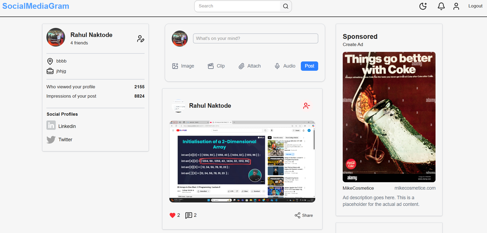
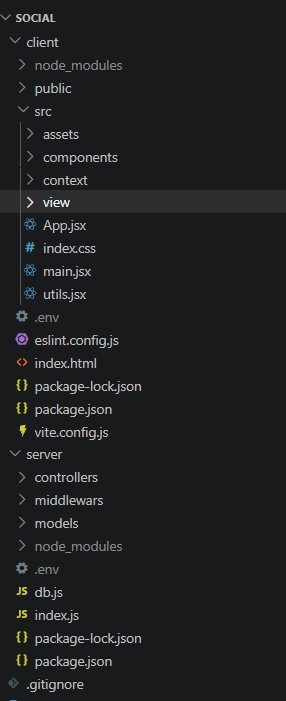

# 📱 SocialMediaGram

A full-stack social media web application where users can connect, share posts, like, comment, and interact with others in real time. 

---

### Live Website 

https://social-media-kvh0.onrender.com/

---

### Pages
- Home
- Login
- Signup
- Profile
- EditProfile

---

### Features
- User Authentication (JWT secure login/register)
- User Profile (bio, profile picture, details)
- Create, edit, and delete posts
- Like & unlike posts
- Comment system
- Image upload support
- Dark / Light mode UI
- Fully responsive design
- Real-time interaction feel

---

### Home Page

---

## Project Structure

---

## Tools & Technologies Used

- React.js  
- Node.js  
- Express.js  
- MongoDB  
- Axios  
- React Router DOM  
- Git & GitHub  
- VS Code  
- Postman